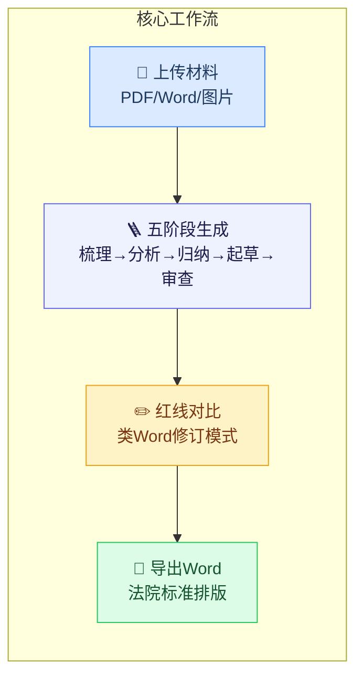
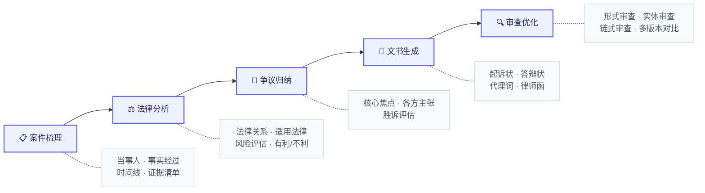
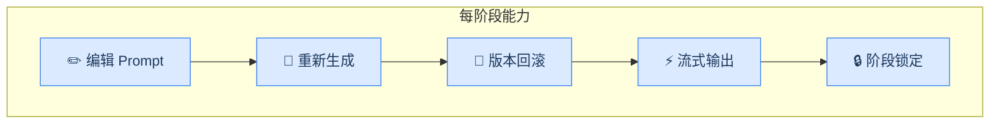
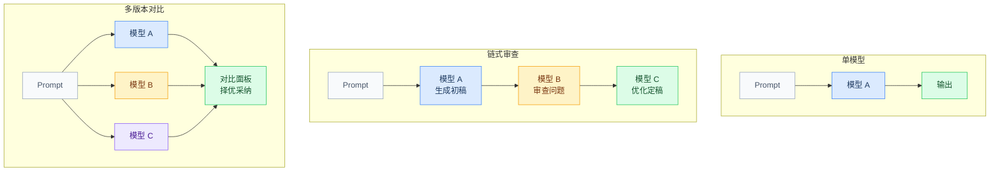
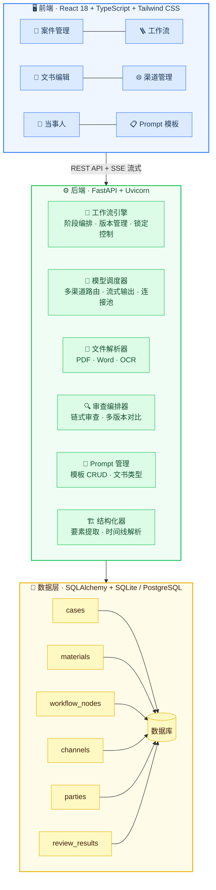
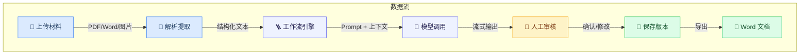

<div align="center">

# ⚖️ LegalDocGen

**AI 驱动的法律文书智能生成与审查系统**

一套面向律师的全流程法律文书工作台——从案件材料解析、法律关系分析到文书生成、多模型审查，以「分阶段可控」为核心设计哲学。

<!-- 🎬 录制 GIF 演示：上传 PDF → 一键生成 → 红线对比 → 导出 Word -->
<!-- 推荐工具：https://www.cockos.com/licecap/ 或 macOS 自带录屏 -->



[](https://python.org)
[](https://fastapi.tiangolo.com)
[](https://react.dev)
[](https://www.docker.com)
[](LICENSE)

</div>

[](https://python.org)
[](https://fastapi.tiangolo.com)
[](https://react.dev)
[](https://www.typescriptlang.org)
[](LICENSE)

<br/>

[快速开始](#-快速开始) · [核心功能](#-核心功能) · [系统架构](#-系统架构) · [API 文档](#-api-文档) · [配置说明](#-配置说明)

</div>

---

## 👨‍⚖️ 给律师/终端用户

## 设计理念

> 律师的工作不是「一键生成文书」，而是**阅读 → 梳理 → 分析 → 起草 → 审查**的渐进过程。
> 每一步都需要人工判断与干预。

LegalDocGen 的核心设计原则：

- **分阶段可控** — 五阶段工作流，每步可独立执行、回滚、重新生成
- **人机协同** — AI 生成初稿，律师审核修改，不替代专业判断
- **多模型交叉** — 支持多模型审查链与版本对比，降低单一模型偏差
- **上下文感知** — 前序阶段输出自动注入后续 Prompt，保持案件连贯性

---

## 核心功能

### 📂 案件管理

| 功能 | 说明 |
|------|------|
| 案件 CRUD | 名称、案号、案由、管辖法院、立案日期等专业字段 |
| 材料上传 | PDF / Word / 图片，自动解析提取文本 |
| 当事人管理 | 手动录入或 AI 从材料中自动提取 |
| 案例检索 | 按名称、案号、案由、状态多维筛选 |
| 批量操作 | 批量删除、状态筛选 |

### 🪜 五阶段工作流





### 🤖 多模型审查



| 模式 | 说明 |
|------|------|
| **单模型** | 传统单次生成 |
| **链式审查** | 模型 A 生成 → 模型 B 审查 → 模型 C 优化，三步流水线 |
| **多版本对比** | N 个模型并行生成，左右对比后择优采纳 |

### 📝 文书编辑器

- 三栏布局：参考面板 · 编辑区 · 实时预览
- AI 辅助编辑：选中文字后浮动工具栏（润色 / 补充法律依据 / 改写 / 精简 / 展开论述 / 对方律师挑刺 / 法官风险评估 / 自定义指令）
- **红线对比**：类 Word 修订模式，红色删除线 + 绿色下划线，律师一目了然
- 防幻觉警告：提醒用户核实 AI 引用的法条和案例
- 撤销栈：Ctrl+Z 多级撤销
- 模板保存/加载：复用常用文书格式
- 导出 Word：标准排版 / **法院标准排版**（方正小标宋 + 仿宋_GB2312 + 28磅行距）

### 📊 案件画像

- 步骤向导：上传材料 → 确认当事人 → 选择文书类型 → 一键生成
- 时间线可视化：自动从材料中提取事件并图形化展示
- 当事人卡片：角色标签、证件号、住址、电话
- 进度概览：五阶段完成状态一目了然

### 🌐 渠道管理

- 多渠道配置：OpenAI / Claude / 自定义 API（兼容 OpenAI 格式）
- 模型自动发现：调用 `/v1/models` 获取可用模型列表
- 连接测试：一键验证渠道可用性
- 优先级调度：多渠道按优先级自动路由

---

## 👨‍💻 给开发者

## 系统架构





---

## 🐳 Docker 一键部署（推荐）

```bash
git clone https://github.com/StanlySGY/LegalDocGen.git
cd LegalDocGen
docker-compose up -d
```

访问 http://localhost:3000 即可使用。

## 快速开始
> 💡 推荐使用 Docker 部署，无需安装 Python/Node 环境。见上方「Docker 一键部署」。

### 前置条件

- Python 3.11+
- Node.js 18+
- 至少一个 AI 模型 API Key

### 1. 克隆项目

```bash
git clone https://github.com/StanlySGY/LegalDocGen.git
cd LegalDocGen
```

### 2. 配置环境变量

```bash
cp backend/.env.example backend/.env
# 编辑 .env，填入你的 API Key（可在系统界面中配置，也可在此预设）
```

### 3. 启动服务

```bash
chmod +x start.sh
./start.sh
```

### 4. 访问系统

| 服务 | 地址 |
|------|------|
| 前端界面 | http://localhost:5173 |
| 后端 API | http://localhost:8002 |
| API 文档 (Swagger) | http://localhost:8002/docs |
| API 文档 (ReDoc) | http://localhost:8002/redoc |

---

## 配置说明

### 环境变量

| 变量 | 说明 | 默认值 |
|------|------|--------|
| `DATABASE_URL` | 数据库连接字符串 | `sqlite:///./legaldocgen.db` |
| `UPLOAD_DIR` | 文件上传目录 | `uploads` |
| `MAX_FILE_SIZE` | 最大文件大小 | `50MB` |

> 💡 模型 API Key 无需在 `.env` 中配置，可通过前端「渠道管理」页面在线添加。

### 支持的文书类型

| 文书类型 | 适用场景 |
|----------|----------|
| 民事起诉状 | 原告提起民事诉讼 |
| 民事答辩状 | 被告回应诉讼 |
| 代理词 | 代理人发表代理意见 |
| 辩护词 | 刑事辩护律师辩护 |
| 律师函 | 向对方发送法律告知 |
| 法律意见书 | 出具专业法律分析 |
| 证据目录 | 编制证据清单 |
| 质证意见 | 对对方证据发表质证 |
| 合同审查意见书 | 合同条款审查分析 |

---

## API 文档

启动后访问 http://localhost:8002/docs 查看完整的 Swagger API 文档。

核心 API 端点：

| 模块 | 端点 | 说明 |
|------|------|------|
| 案件 | `POST /api/cases` | 创建案件 |
| 材料 | `POST /api/materials/upload/{id}` | 上传材料 |
| 工作流 | `POST /api/workflow/generate-stream/{id}` | 流式生成 |
| 工作流 | `POST /api/workflow/review-chain/{id}` | 链式审查 |
| 工作流 | `POST /api/workflow/export/{id}` | 导出 Word |
| 渠道 | `GET /api/channel/fetch_models/{id}` | 发现模型 |
| 当事人 | `POST /api/parties/extract/{id}` | AI 提取当事人 |

---

## 技术栈

| 层级 | 技术 |
|------|------|
| 前端 | React 18 · TypeScript · Tailwind CSS · Vite · React Router 6 · React Markdown |
| 后端 | FastAPI · SQLAlchemy · Pydantic · Uvicorn |
| 文件解析 | pdfplumber · python-docx · pytesseract / easyocr |
| AI 集成 | OpenAI SDK · Anthropic SDK · httpx（通用 OpenAI 兼容接口） |
| 数据库 | SQLite（默认）· 可切换 PostgreSQL |
| 导出 | python-docx（Word 文档生成） |

---

## 项目结构

```
LegalDocGen/
├── backend/
│   ├── main.py                 # FastAPI 入口
│   ├── config.py               # 配置管理
│   ├── database.py             # 数据库初始化
│   ├── seed.py                 # 示例数据
│   ├── models/                 # SQLAlchemy 模型
│   │   ├── case.py             #   案件
│   │   ├── material.py         #   材料
│   │   ├── workflow.py         #   工作流节点
│   │   ├── channel.py          #   API 渠道
│   │   ├── party.py            #   当事人
│   │   ├── prompt.py           #   Prompt 模板
│   │   ├── review.py           #   审查结果
│   │   └── template.py         #   文书模板
│   ├── routers/                # API 路由
│   ├── services/               # 业务服务
│   │   ├── workflow_engine/    #   工作流引擎
│   │   ├── model_dispatcher/   #   模型调度器
│   │   ├── file_parser/        #   文件解析
│   │   ├── prompt_manager/     #   Prompt 管理
│   │   ├── review_orchestrator/#   审查编排
│   │   └── structurer/         #   结构化器
│   └── requirements.txt
├── frontend/
│   └── src/
│       ├── App.tsx             # 路由与布局
│       ├── pages/              # 页面组件
│       ├── components/         # 通用组件
│       ├── services/api.ts     # API 客户端
│       └── types/              # TypeScript 类型
├── start.sh                    # 一键启动脚本
└── README.md
```

---

## 🔒 安全与隐私

- **本地部署**：系统完全开源，所有数据存储在您本地的 SQLite 数据库中
- **不收集数据**：本系统不收集、不上传任何用户数据
- **API 数据流向**：调用 AI 模型时，案件内容会直接发送至您配置的大模型服务商（如 OpenAI、Claude），不经过任何中间服务器
- **一键脱敏**：支持自动替换身份证号、手机号、姓名等敏感信息
- **建议**：处理涉密案件时，请使用自建的大模型服务或本地模型

---

## 许可证

MIT License

---

<div align="center">

**Built with ⚖️ for legal professionals**

</div>
